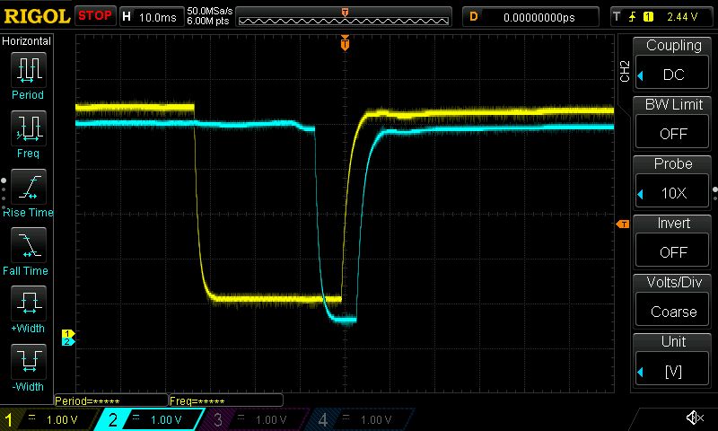
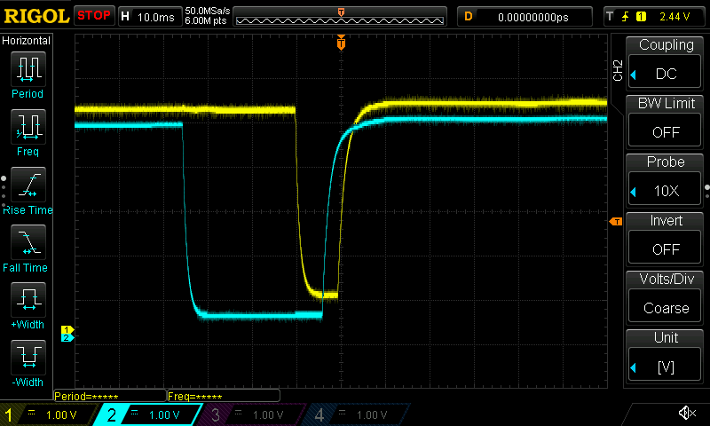

# ch32-fan-control

This is a simple PWM fan control program built with the ch32fun library.

### Rotary encoder
This project uses an EC11 rotary encoder.

In the screen captures below, hannel 1 is S1 and channel 2 is S2.

**Clockwise**

**Counter-clockwise**
